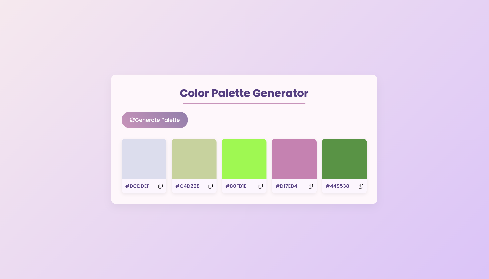

# 🎨 Color Palette Generator

A clean and responsive web application that generates random color palettes and allows users to copy hex codes with a single click. Designed with a modern UI using HTML, CSS (Poppins font & custom styles), and JavaScript.

[🔗 Live Demo](https://arjun-p-manoj.github.io/Color-Palette-Generator/)

---

## ✨ Features

- ✅ Random 5-color palette generation
- 📋 One-click hex code copy to clipboard
- 💻 Responsive grid layout
- 🌈 Beautiful gradient backgrounds & animations
- 🎨 FontAwesome icons for better UX

---

## 📸 Preview



---

## 🚀 Getting Started

### 1. Clone the repository

```bash
git clone https://github.com/arjun-p-manoj/Color-Palette-Generator.git
cd Color-Palette-Generator
